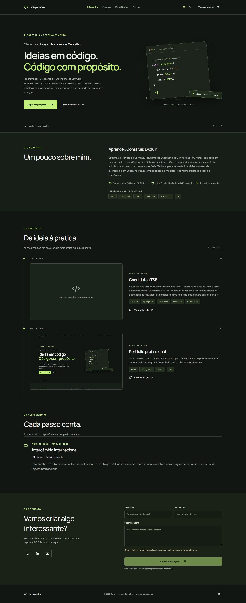
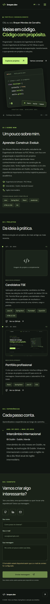

# Portfólio profissional


## Status do projeto

Versão local funcional. A entrega final do LAB01 ainda depende de publicação na nuvem, configuração e validação do envio de e-mail, protótipos no Figma e captura do projeto Candidatos TSE em funcionamento.

## Links úteis

- [Repositório](https://github.com/BrayanMCarvalho/Portfolio-Profissional).
- [Aplicação local](http://localhost:5173).
- Site publicado: pendente.
- Protótipos no Figma: pendentes.

## Sobre o projeto

Portfólio de Brayan Mendes de Carvalho, estudante de Engenharia de Software na PUC Minas. Desenvolvido para o Laboratório 01 de DIAW, reúne formação, habilidades, projetos, experiências e canais de contato em uma interface responsiva em português e inglês.

## Funcionalidades principais

- Menu para Sobre Mim, Projetos, Experiências e Contato.
- Apresentação bilíngue com preferência de idioma salva no navegador.
- Timeline dinâmica com Candidatos TSE e Portfólio profissional, datas, descrições, tecnologias e links para o GitHub.
- Ordenação do mais antigo ao mais recente, conforme o enunciado do LAB01.
- Experiência de intercâmbio na ISI Dublin com instituição, atividade, período e descrição.
- Links de e-mail, GitHub e LinkedIn. WhatsApp disponível quando seu endereço for preenchido no conteúdo.
- Formulário com nome, e-mail e mensagem, validação, proteção por honeypot e limite de tentativas. O envio usa a API do Resend no backend e exige configuração.

## Tecnologias e dependências

| Camada | Tecnologias e bibliotecas | Finalidade |
| --- | --- | --- |
| Frontend | React 19, React DOM 19, JavaScript, HTML e CSS | Interface responsiva |
| Ícones | Lucide React | Ícones SVG |
| Build | Vite 7, plugin React 5, npm | Desenvolvimento e produção |
| Backend | Java 21, Spring Boot 3.5.16, Maven | API e servidor |
| API e validação | Spring Web, Jackson, Spring Validation / Jakarta Validation | JSON, HTTP e validação dos campos |
| E-mail | API HTTPS do Resend | Encaminhamento das mensagens |
| Infraestrutura | Docker, configuração para Render | Empacotamento e hospedagem |

Versões do frontend em `frontend/package-lock.json`; dependências do backend em `backend/pom.xml`. O projeto não utiliza banco de dados.

## Arquitetura

O React consulta o conteúdo em `GET /api/portfolio`. O Spring Boot lê `portfolio.json` na inicialização e recebe mensagens em `POST /api/contact`, encaminhando-as ao Resend. `GET /api/health` indica a saúde do backend; `GET /api/contact/status` indica se as variáveis de envio estão preenchidas.

No desenvolvimento, o Vite encaminha `/api` para a porta 8080. No Docker, o frontend compilado é servido pelo Spring Boot. As credenciais de e-mail ficam no backend.

## Instalação e execução

Requisitos: JDK 21, Maven 3.9+ e Node.js 22.12+ ou 24.

Clone o projeto:

```powershell
git clone https://github.com/BrayanMCarvalho/Portfolio-Profissional.git
cd Portfolio-Profissional
```

Terminal do backend:

```powershell
cd backend
mvn spring-boot:run
```

Em outro terminal, na raiz do projeto:

```powershell
cd frontend
npm ci
npm run dev
```

Abra http://localhost:5173. Ambos os processos devem permanecer ativos.

### Configuração do contato

Defina as variáveis no ambiente do backend antes de iniciá-lo:

| Variável | Conteúdo |
| --- | --- |
| `RESEND_API_KEY` | Chave privada do Resend |
| `CONTACT_FROM` | Remetente autorizado no provedor |
| `CONTACT_TO` | E-mail de destino |
| `PORT` | Porta opcional, padrão 8080 |

No PowerShell, use `$env:CONTACT_TO = 'seu-email@dominio.com'` e configure as demais variáveis da mesma forma. Arquivos `.env` não são carregados automaticamente. Sem configuração, o formulário fica desabilitado. Para validar a entrega, envie uma mensagem real e confira a caixa de entrada do destinatário.

### Desenvolvimento

Edite o conteúdo em `backend/src/main/resources/portfolio.json` e reinicie o backend. Imagens utilizadas pelo site ficam em `frontend/public/projects`. Para validar os builds, execute `npm run build` no frontend e `mvn package` no backend.

### Docker

Na raiz:

```powershell
docker build -t portfolio .
docker run --rm -p 8080:8080 --env RESEND_API_KEY --env CONTACT_FROM --env CONTACT_TO portfolio
```

As variáveis devem existir no terminal antes da execução. Abra http://localhost:8080. A imagem Docker ainda não foi validada neste ambiente.

## Deploy

O projeto inclui Dockerfile e `render.yaml`, preparados para o repositório independente Portfolio-Profissional. Publique como serviço Docker, configure as três variáveis de e-mail e use `/api/health` como verificação de saúde. Após o deploy, confira a navegação, os projetos, o layout móvel e o envio de e-mail, e registre a URL em Links úteis. A publicação ainda está pendente.

## Estrutura de pastas

```text
Portfolio-Profissional/
├── backend/
│   ├── pom.xml
│   └── src/main/
│       ├── java/br/com/portfolio/   # API, validação e e-mail
│       └── resources/              # Configuração e conteúdo JSON
├── frontend/
│   ├── public/                     # Favicon e imagens dos projetos
│   ├── src/                        # Componentes React e CSS
│   ├── index.html
│   ├── package.json
│   ├── package-lock.json
│   └── vite.config.js
├── docs/                           # Capturas da aplicação
├── Dockerfile
├── render.yaml
└── README.md
```

## Demonstração e protótipos

Capturas reais da aplicação local com os dois projetos:





Essas capturas demonstram a implementação. Os wireframes de média fidelidade no Figma e suas imagens precisam ser adicionados para documentar a Sprint 01. O projeto Candidatos TSE ainda precisa de imagem ou GIF real em funcionamento.

## Verificação

Build do frontend e compilação Java verificados localmente. O envio real de e-mail e a hospedagem ainda precisam ser validados.

## Documentações utilizadas

- [Template de README do professor](https://github.com/joaopauloaramuni/desenvolvimento-e-integracao-de-aplicacoes-web/blob/main/TEMPLATES/template_README.md), adaptado às partes aplicáveis do projeto.
- [React](https://react.dev/).
- [Vite](https://vite.dev/).
- [Spring Boot](https://docs.spring.io/spring-boot/).
- [Resend](https://resend.com/docs).

## Autor

Brayan Mendes de Carvalho — Engenharia de Software, PUC Minas.

## Agradecimentos

Ao professor João Paulo Carneiro Aramuni, pela proposta do laboratório e pelo modelo de documentação.

## Licença

Ainda não definida pelo autor.
